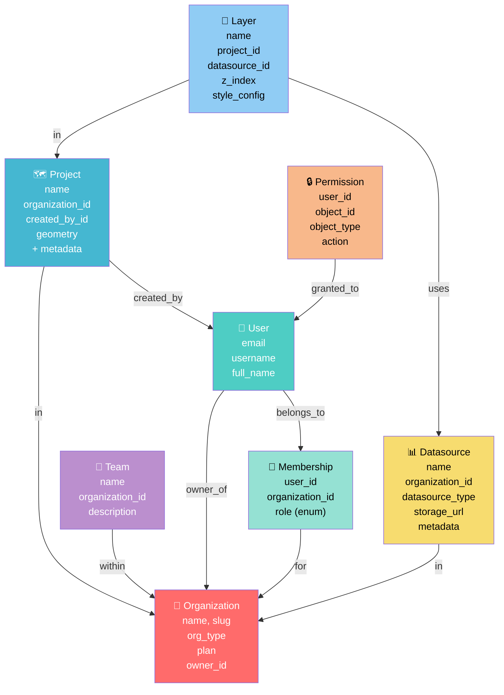

# 🏗️ Visão Geral da Arquitetura

Uma visão técnica da plataforma **coordgeo** - como os componentes se comunicam, como os dados fluem e decisões arquiteturais.

---

## 🔄 Fluxo de Request

```
┌──────────────────────────────────────────────────────────────────┐
│                    Frontend (MapLibre GL)                         │
│              Envia: X-Organization-ID header                      │
└─────────────────────────┬──────────────────────────────────────────┘
                          │
                          │ POST /api/projects/
                          │ Header: X-Organization-ID: <org-uuid>
                          │ Body: {name, description, geometry}
                          │
┌─────────────────────────▼──────────────────────────────────────────┐
│              Django REST Framework + DRF Router                    │
│                      (api/urls.py)                                  │
└─────────────────────────┬──────────────────────────────────────────┘
                          │
┌─────────────────────────▼──────────────────────────────────────────┐
│            Permission Classes (request validation)                 │
│  ┌────────────────────────────────────────────────────────────┐  │
│  │ 1. IsAuthenticated                                         │  │
│  │    → Valida JWT token é válido                            │  │
│  │                                                            │  │
│  │ 2. IsOrgMember                                            │  │
│  │    → Extrai X-Organization-ID do header                  │  │
│  │    → Valida user é membro da org (Membership query)      │  │
│  │    → Setta request.active_organization se válido         │  │
│  │    → Retorna 400 se header falta                         │  │
│  │    → Retorna 403 se user não é membro                    │  │
│  └────────────────────────────────────────────────────────────┘  │
└─────────────────────────┬──────────────────────────────────────────┘
                          │
┌─────────────────────────▼──────────────────────────────────────────┐
│               ViewSet (projects/views.py)                          │
│  ┌────────────────────────────────────────────────────────────┐  │
│  │ get_queryset(self):                                        │  │
│  │   # Filtra APENAS projetos da active_organization         │  │
│  │   return Project.objects.filter(                           │  │
│  │     organization=request.active_organization              │  │
│  │   )                                                        │  │
│  │                                                            │  │
│  │ perform_create(self, serializer):                         │  │
│  │   # FORÇA organization = active_organization              │  │
│  │   # NUNCA usa client-provided organization!               │  │
│  │   serializer.save(                                        │  │
│  │     organization=request.active_organization,             │  │
│  │     created_by=request.user                               │  │
│  │   )                                                        │  │
│  └────────────────────────────────────────────────────────────┘  │
└─────────────────────────┬──────────────────────────────────────────┘
                          │
┌─────────────────────────▼──────────────────────────────────────────┐
│              Django ORM (models layer)                             │
│  Project.objects.filter(organization=active_org)                  │
│  → Gera SQL com WHERE organization_id = ?                         │
│  → Usa index em organization field para performance               │
└─────────────────────────┬──────────────────────────────────────────┘
                          │
┌─────────────────────────▼──────────────────────────────────────────┐
│       PostgreSQL + PostGIS Extension (Spatial Database)            │
│  ┌────────────────────────────────────────────────────────────┐  │
│  │ CREATE INDEX idx_project_org ON project(organization_id); │  │
│  │                                                            │  │
│  │ SELECT * FROM project                                     │  │
│  │ WHERE organization_id = $1  -- Usa index!               │  │
│  │ AND geometry && ST_Box2D(?)  -- Spatial query            │  │
│  └────────────────────────────────────────────────────────────┘  │
└────────────────────────────────────────────────────────────────────┘
```

---

## 📊 Modelo de Dados



> 💡 **Diagrama ER Automático**: Veja [diagrams/data-model.png](./diagrams/data-model.png) para visualização completa do modelo gerado automaticamente com django-extensions.

### Hierarquia de Isolamento

```
Organization (Root)
├── Membership (User → Role)
├── Project 1
│   ├── Layer A (Datasource X)
│   └── Layer B (Datasource Y)
├── Project 2
│   └── Layer C (Datasource Y)
├── Datasource X (Compartilhado entre projects)
├── Datasource Y
└── Datasource Z
```

**Regra crítica**: `Organization` **SEMPRE** é a raiz de isolamento. Nenhum modelo org-scoped pode existir sem FK para Organization.

---

## 🔐 Contexto de Organização Ativa

Usuários podem pertencer a **múltiplas organizações**. O contexto ativo é especificado via header HTTP:

### Request

```http
POST /api/projects/ HTTP/1.1
Authorization: Bearer <JWT_TOKEN>
X-Organization-ID: 550e8400-e29b-41d4-a716-446655440000
Content-Type: application/json

{
  "name": "Amazon Deforestation 2024",
  "description": "Monitor deforestation in the Amazon",
  "geometry": { "type": "Polygon", "coordinates": [...] }
}
```

### Fluxo na Permission Class

```python
# organizations/permissions.py - IsOrgMember

def has_permission(self, request, view):
    # 1. Extrai header
    org_id = request.headers.get('X-Organization-ID')
    
    if not org_id:
        raise ValidationError({'detail': 'X-Organization-ID header required'})
    
    # 2. Valida membership
    try:
        membership = Membership.objects.get(
            organization_id=org_id,
            user=request.user
        )
    except Membership.DoesNotExist:
        raise PermissionDenied(
            'User is not member of specified organization'
        )
    
    # 3. Setta no request
    request.active_organization = membership.organization
    request.active_membership = membership  # para verificar role depois
    
    return True
```

### Tratamento de Erros

| Cenário | HTTP Status | Motivo |
|---------|------------|--------|
| Header `X-Organization-ID` ausente | `400 Bad Request` | Contexto não especificado |
| User não é membro da org | `403 Forbidden` | Acesso negado |
| JWT token inválido | `401 Unauthorized` | Autenticação falha |
| Org ID mal formatado | `400 Bad Request` | Validation error |

---

## 🔌 API Router

Registrado em `api/urls.py` usando DRF `DefaultRouter`:

```python
router = DefaultRouter()
router.register(r"users", UserViewSet)
router.register(r"organizations", OrganizationViewSet)
router.register(r"memberships", MembershipViewSet)
router.register(r"teams", TeamViewSet)
router.register(r"projects", ProjectViewSet)
router.register(r"layers", LayerViewSet)
router.register(r"datasources", DatasourceViewSet)
router.register(r"permissions", PermissionViewSet)
```

Gera URLs padrão CRUD:
- `GET /api/projects/` - List (paginated)
- `POST /api/projects/` - Create
- `GET /api/projects/{id}/` - Retrieve
- `PUT /api/projects/{id}/` - Update
- `DELETE /api/projects/{id}/` - Delete

---

## 🗄️ Database Layer

### PostgreSQL + PostGIS

Requisitos:
- PostgreSQL 13+
- PostGIS extension habilitada
- Python psycopg2 para conexão

### Indexes Obrigatórios

Todo modelo org-scoped DEVE ter:

```python
class Meta:
    indexes = [
        models.Index(fields=["organization"]),  # Para filtering
        models.Index(fields=["created_by"]),    # Para auditoria
    ]
```

Modelos com geometria DEVEM ter spatial index:

```python
class Project(models.Model):
    geometry = gis_models.GeometryField(
        spatial_index=True,  # PostGIS spatial index
        srid=4326            # WGS84
    )
```

### Otimizações de Query

```python
# ❌ RUIM - N+1 queries
for project in Project.objects.all():
    print(project.organization.name)  # Query por projeto!

# ✅ BOM - Single query com join
projects = Project.objects.select_related('organization', 'created_by')

# ✅ MELHOR - Para grandes datasets
projects = Project.objects.filter(
    organization=active_org
).values_list('id', 'name')  # Sem geometria pesada
```

---

## 🔄 Autenticação JWT

Configurado com `djangorestframework-simplejwt`:

### Flow

```
1. POST /api/token/ + email + password
   → djangorestframework-simplejwt retorna {access, refresh}

2. Cliente armazena access token

3. Requests subsequentes:
   Authorization: Bearer <access_token>
   X-Organization-ID: <org-id>

4. Django valida JWT + IsAuthenticated + IsOrgMember
```

### Configuração (config/settings.py)

```python
INSTALLED_APPS = [
    'rest_framework_simplejwt',
    ...
]

REST_FRAMEWORK = {
    'DEFAULT_AUTHENTICATION_CLASSES': [
        'rest_framework_simplejwt.authentication.JWTAuthentication',
    ],
    'DEFAULT_PERMISSION_CLASSES': [
        'rest_framework.permissions.IsAuthenticated',
    ],
}

SIMPLE_JWT = {
    'ACCESS_TOKEN_LIFETIME': timedelta(minutes=5),
    'REFRESH_TOKEN_LIFETIME': timedelta(days=1),
}
```

---

## 🌐 Geospatial Stack

### GeoDjango + PostGIS

Modelos espaciais:

```python
from django.contrib.gis.db import models as gis_models

class Project(models.Model):
    # Suporta qualquer geometria (Point, Polygon, MultiPolygon, etc)
    geometry = gis_models.GeometryField(
        null=True, blank=True,
        spatial_index=True,
        srid=4326  # WGS84 (lat, lng)
    )
```

### Serializers com GeoJSON

```python
from rest_framework_gis.serializers import GeoFeatureModelSerializer

class ProjectSerializer(GeoFeatureModelSerializer):
    class Meta:
        model = Project
        geo_field = 'geometry'  # auto-serializa para GeoJSON
        fields = ['id', 'name', 'geometry', 'created_at']
```

### Queries Espaciais

```python
from django.contrib.gis.db.models import Q
from django.contrib.gis.geos import Polygon

# Filtrar por bbox
bbox = Polygon([...])  # Bounding box
projects = Project.objects.filter(
    organization=active_org,
    geometry__intersects=bbox
)

# Distance queries
from django.db.models.functions import Distance
projects = Project.objects.annotate(
    distance=Distance('geometry', point)
).filter(distance__lte=F('buffer_distance'))
```

---

## 🧪 Testing Strategy

### Multi-Tenant Isolation Tests

Obrigatório para toda feature nova:

```python
def test_organization_isolation(self):
    """User from Org A cannot see Org B data"""
    self.client.force_authenticate(user=self.user_a)
    headers = {'HTTP_X_ORGANIZATION_ID': str(self.org_a.id)}
    response = self.client.get('/api/projects/', **headers)
    
    project_ids = [p['id'] for p in response.data['results']]
    self.assertNotIn(str(self.project_b.id), project_ids)

def test_missing_organization_header(self):
    """Request without header retorna 400"""
    self.client.force_authenticate(user=self.user_a)
    response = self.client.get('/api/projects/')  # No header!
    self.assertEqual(response.status_code, 400)

def test_unauthorized_organization(self):
    """User not member of org returns 403"""
    self.client.force_authenticate(user=self.user_a)
    headers = {'HTTP_X_ORGANIZATION_ID': str(self.org_b.id)}
    response = self.client.get('/api/projects/', **headers)
    self.assertEqual(response.status_code, 403)
```

---

## 📈 Escalabilidade

### Performance Considerations

1. **Pagination** - Todas list endpoints são paginadas (50 itens/página default)
2. **Spatial indexes** - Geometry queries usam PostGIS indexes
3. **Select-related** - ViewSets usam `.select_related()` para evitar N+1
4. **Caching** - Redis para sessions/cache (configurável)
5. **Async** - Celery para long-running tasks (Raster processing, etc)

### Quotas (Future)

```python
class Organization(models.Model):
    subscription_plan = CharField(choices=Plan.choices)
    user_limit = IntegerField()
    storage_limit_gb = IntegerField()
    datasource_limit = IntegerField()
```

Quando implementar quotas, usar hooks em `perform_create()` para validação.

---

## 🚀 Deployment

### Production Stack

```
Client (Browser)
    ↓
Reverse Proxy (nginx)
    ↓
Gunicorn (4+ workers)
    ↓
Django Application
    ↓
PostgreSQL + PostGIS
```

### WSGI Server

```bash
gunicorn config.wsgi:application \
  --bind 127.0.0.1:8000 \
  --workers 4 \
  --threads 2 \
  --worker-class gthread
```

---

## 📚 Referências Rápidas

- **Permission class**: [organizations/permissions.py](../organizations/permissions.py#L1)
- **User model**: [accounts/models.py](../accounts/models.py)
- **Organization hirarchy**: [organizations/models.py](../organizations/models.py)
- **Geospatial models**: [projects/models.py](../projects/models.py)
- **API Router**: [api/urls.py](../api/urls.py)

---

**Status**: Production-Ready  
**Last updated**: March 2025
